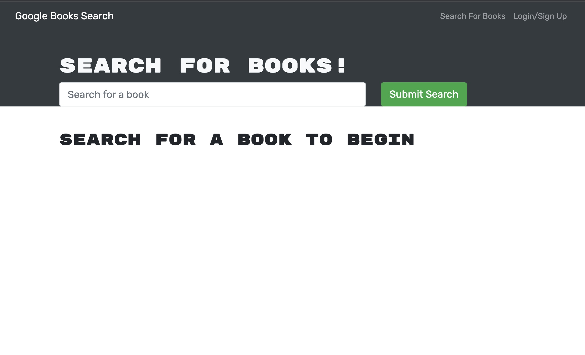
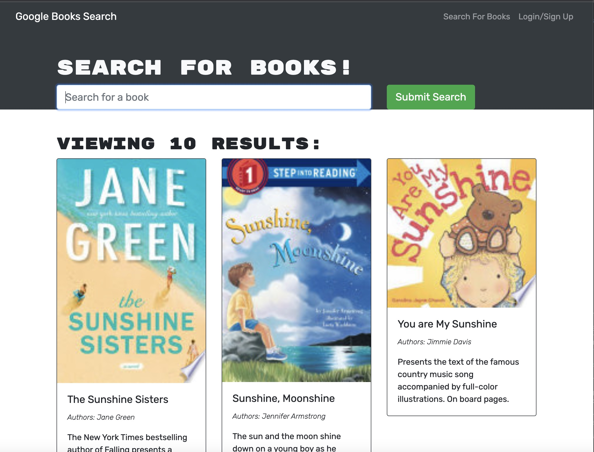
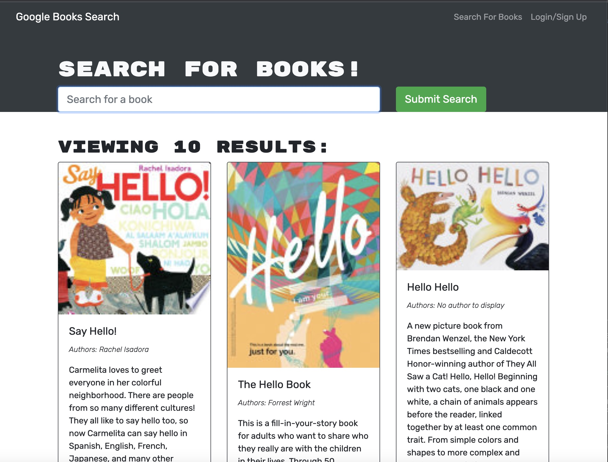
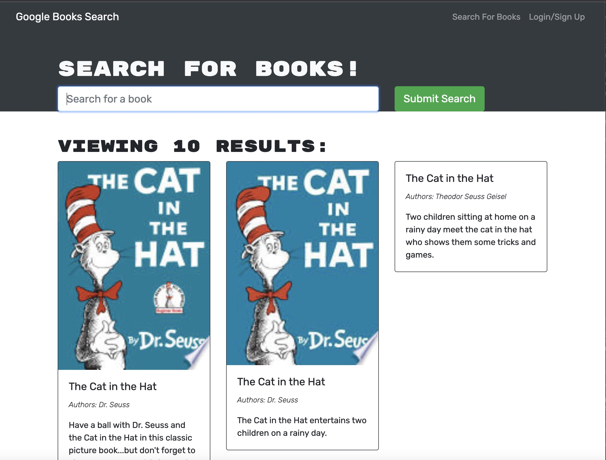

# BookSearchEngine

## Description
- The Book search engine uses the MERN stack and with a React front end, MongoDB database, and Node js & Express js server. It's set up to allow users to save book searches to their profile and view the books and their details. The application is built using Google Books API so that users can click a link that takes them to google books. The search engine is built with GraphQL API and Apollo Server.git

## Table of Contents
- [Title](#title)
- [Installation](#installation)
- [Usage](#usage)
- [Tests](#tests)
- [Contributing](#contributing)
- [Questions](#questions)
- [Mock-Up](#mock-up)

## Installation
- User should clone this repository from GitHub.

## Usage
- This application allows to search for the books, save books to your saved book list and remove books from the saved book list.

## License
None.

## Tests
None.

## Contributing
To contribute to this application: Please email the author for guidelines.

## Questions
If you have any questions about the repo, open an issue or contact me directly at tiannaj23@gmail.com. You can find more of my work at [https://github.com/tiannaj23](https://github.com/https://github.com/tiannaj23/).

## Mock-Up

- 
- 
-
-